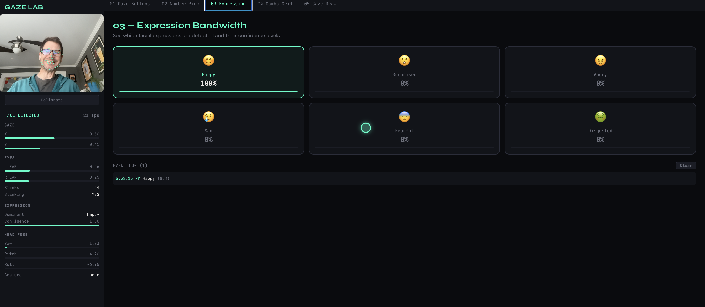
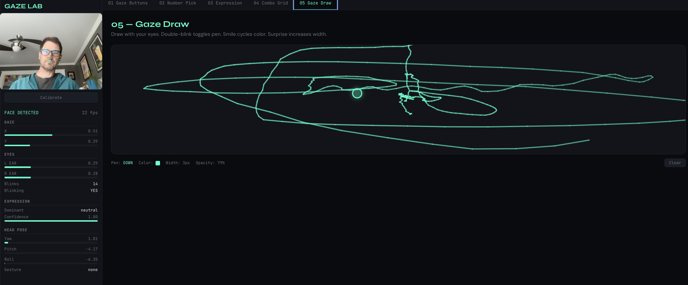

# Gaze Lab

**"How many input channels does a human face have?"**

**[Try it now](https://d-eastman.github.io/gaze-lab/)** — runs entirely in your browser, no install needed. Just allow camera access.

Gaze Lab is a browser-based experimental platform that explores non-touch, non-voice human-computer interaction using only a webcam. It extracts multiple simultaneous input channels from your face — gaze direction, blinks, facial expressions, and head pose — and lets you interact with five different experiments using nothing but your face.





## Quick Start

```bash
# Install dependencies
npm install

# Download face detection model weights
npm run models:download

# Start the development server
npm run dev
```

Open [http://localhost:5173](http://localhost:5173) in your browser. You'll need to **allow camera access** when prompted.

## What You'll See

The app has a sidebar on the left showing your camera feed with face landmark overlay, plus a real-time telemetry panel. The main area has five experiment tabs.

### Your First Session

1. **Let the models load.** The first time, face-api.js models load from `public/models/`. You'll see "FACE DETECTED" in the sidebar when your face is recognized.

2. **Try Experiment 01 — Gaze Buttons.** Look at one of the four colored buttons for 1.5 seconds. A progress bar fills as you hold your gaze, and the button activates when full.

3. **Calibrate.** Click the "Calibrate" button in the sidebar. Look at each of the 9 dots that appear on screen for 2 seconds each. This improves gaze accuracy.

4. **Explore the other experiments.** Each one tests different face input channels.

## Experiments

| # | Name | What It Tests | How to Use |
|---|------|--------------|------------|
| 01 | **Gaze Buttons** | Dwell activation | Look at a button for 1.5s to activate it |
| 02 | **Number Pick** | Gaze + blink | Look at a number, double-blink to select it |
| 03 | **Expression Bandwidth** | Facial expressions | Smile, act surprised, frown — see which expressions are detected |
| 04 | **Combo Grid** | Multi-channel input | Look at a box (gaze), double-blink (select), smile (lighten), surprise (darken), tilt head (shift color) |
| 05 | **Gaze Draw** | Drawing with face | Double-blink to toggle pen, smile to change color, look around to draw |

## Face Input Channels

The platform detects these signals from your webcam:

- **Gaze direction** — Where you're looking on screen (via head pose + nose position)
- **Blinks** — Single blink, double-blink, left wink, right wink
- **Expressions** — Happy, surprised, angry, sad, fearful, disgusted
- **Head pose** — Yaw (left/right), pitch (up/down), roll (tilt)
- **Gestures** — Head tilt, nod, shake

## Tips for Best Results

- **Good lighting** makes a big difference. Face a window or desk lamp.
- **Stay ~18-24 inches** from your webcam.
- **Calibrate** after any window resize or position change.
- **Glasses** may affect blink detection — adjust lighting to reduce glare.

## Development

```bash
npm run dev          # Development server
npm run build        # Production build
npm test             # Run tests (82 tests)
npm run test:watch   # Tests in watch mode
npm run lint         # ESLint
```

## Tech Stack

- **React 19** + TypeScript + Vite
- **face-api.js** (`@vladmandic/face-api`) — Face detection, 68-point landmarks, expression classification
- **Vitest** + React Testing Library — 82 unit/integration tests

## Project Structure

```
src/
  engine/          # Face detection + signal processing pipeline
  calibration/     # 9-point gaze calibration system
  hooks/           # React hooks for face signals
  experiments/     # Five self-contained experiment modules
  components/      # Shared UI (camera feed, telemetry, gaze cursor)
  utils/           # Geometry, smoothing, timing, constants
  styles/          # Theme tokens + global CSS
tests/
  engine/          # Signal detector tests
  experiments/     # Component tests
  utils/           # Utility function tests
  integration/     # End-to-end signal pipeline tests
```

## License

Personal experimental / open-source.
